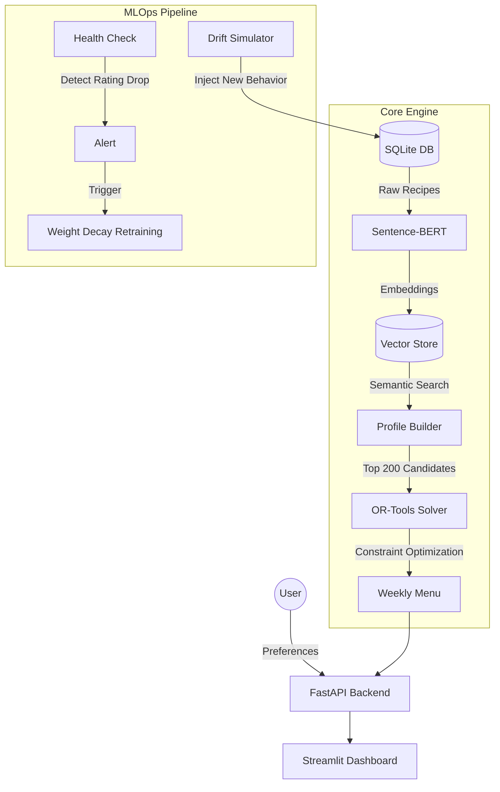

# 🥗 SmartRetail RecSys: AI-Powered Meal Planner

> **An End-to-End AI Engineering Project:** From Semantic Search to Constraint Optimization and MLOps.

**SmartRetail RecSys** is an intelligent menu generation engine. Unlike standard recommenders that suggest isolated items, this system builds coherent **weekly meal plans** that respect strict nutritional and logistical constraints (Calories, Prep Time, Diversity).

It combines **NLP (Sentence-BERT)** to understand user tastes and **Operations Research (Google OR-Tools)** to solve the scheduling puzzle.

---

## 🏗️ Architecture

The system follows a modular "Lakehouse" architecture, separating the Intelligence (AI) from the Logic (Solver) and the Service (API).



## ✨ Key Features

### 1. 🧠 Semantic Recommendation (The Brain)
Instead of matching keywords, the system uses **Sentence-Transformers (`all-MiniLM-L6-v2`)** to vectorize recipe descriptions.
* *Benefit:* It understands that "Tofu" and "Tempeh" are semantically close, even if the words differ.
* *Technique:* Cosine Similarity on 384-dimensional dense vectors.

### 2. 🧩 Constraint Solving (The Logic)
Recommending high-score items is easy. Building a valid schedule is hard.
We use **Google OR-Tools** (CP-SAT) to enforce:
* **Hard Constraints:** Max prep time (e.g., < 30min), Calorie range (400-900 kcal).
* **Logic Constraints:** No "Desserts" as main courses.
* **Diversity:** Never repeat the same recipe in a week.

### 3. 🔄 MLOps & Drift Management
A simulation of **Concept Drift** (e.g., a user becoming Vegetarian) demonstrates the system's resilience.
* **Monitor:** Tracks rolling average satisfaction.
* **Retrainer:** Applies a **Time-Decay** function to user embeddings, prioritizing recent interactions over historical data to pivot recommendations dynamically.

---

## 🛠️ Tech Stack

* **Language:** Python 3.12
* **Dependency Manager:** Poetry
* **AI/NLP:** `sentence-transformers`, `scikit-learn`, `numpy`
* **Optimization:** `ortools`
* **Backend:** `fastapi`, `uvicorn`, `sqlalchemy`
* **Frontend:** `streamlit`
* **Database:** SQLite (SQLAlchemy ORM)

---

## 🚀 Getting Started

### 1. Installation
```bash
# Clone repository
git clone https://github.com/cyrilleelie/smartretail-recsys.git
cd smartretail-recsys

# Install dependencies with Poetry
poetry install
```

### 2. Data Setup (Crucial Step)
Since raw data is not hosted on GitHub (file size limit), you need to download it manually:
1.  Create the data directory:
    ```bash
    mkdir -p data/raw
    ```
2.  Download the **Food.com Recipes Dataset** (specifically `RAW_recipes.csv`) from Kaggle:
    * [Link to Dataset](https://www.kaggle.com/datasets/shuyangli98/food-com-recipes-and-user-interactions)
3.  Place the file at: `data/raw/RAW_recipes.csv`

### 3. Initialization
Once the CSV is in place, run the initialization scripts to generate the SQL Database and Vector Embeddings.
```bash
# 1. Ingest CSV into SQLite
poetry run python -m src.database.init_db

# 2. Simulate User History (Cold Start)
poetry run python -m src.simulation.user_simulator

# 3. Generate NLP Embeddings (this takes ~1-2 mins)
poetry run python -m src.recommender.vectorizer
```

### 4. Running the App
Launch the API and the Dashboard in two separate terminals.

**Terminal 1 (Backend):**
```bash
poetry run uvicorn src.api.app:app --reload
```

**Terminal 2 (Frontend):**
```bash
poetry run streamlit run src/ui/dashboard.py
```

Access the dashboard at: `http://localhost:8501`

---

## 📉 MLOps Scenario: The "Vegetarian Shift"

This project includes a script to simulate **Concept Drift**.

1.  **Run the Monitor:** Check current health.
    ```bash
    poetry run python -m src.mlops.monitor
    # Output: ✅ Model is healthy.
    ```

2.  **Simulate Drift:** Inject interactions where the user rejects meat and likes vegetables.
    ```bash
    poetry run python -m src.mlops.drift_simulator
    # Output: 🚨 20 new interactions injected (User became vegetarian).
    ```

3.  **Detect & Repair:** Run the retraining pipeline.
    ```bash
    poetry run python -m src.mlops.retrain
    # Output: ✅ Profile successfully pivoted. New recommendations: "Carrot Salad", "Tofu Stir-fry".
    ```

---

## 📂 Project Structure

```text
smartretail-recsys/
├── src/
│   ├── api/             # FastAPI endpoints & Pydantic schemas
│   ├── database/        # SQL Models & Data Init
│   ├── mlops/           # Drift Simulation & Retraining Logic
│   ├── optimization/    # OR-Tools Solver (The Constraints Engine)
│   ├── recommender/     # Sentence-BERT Vectorizer & Profiler
│   ├── simulation/      # User interaction generator
│   ├── ui/              # Streamlit Dashboard
│   └── main.py          # CLI entry point
├── poetry.lock
├── pyproject.toml
└── README.md
```

## 👤 Author

**Cyrille ELIE** - AI Engineer Portfolio Project.